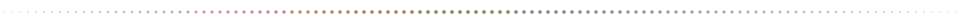
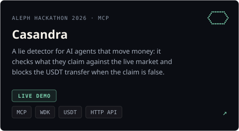
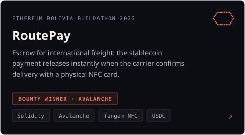
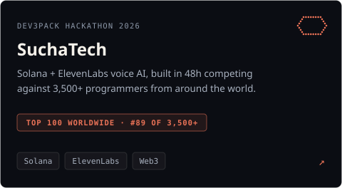
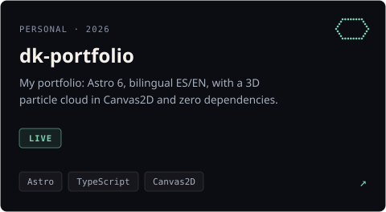
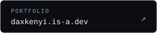
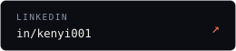
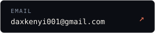

<h1 align="center">Dax Kenji Tellez Duran</h1>

  <code>backend &amp; ai engineer</code>&nbsp;·&nbsp;<code>santa cruz, bo</code>&nbsp;·&nbsp;<code>open to roles</code>

  <a href="https://github.com/Kenyi001">Español</a>&nbsp;·&nbsp;<b>English</b>

  

  I build backend and AI systems that make it to production, 
  always starting from understanding the real problem before writing code.

<picture>
  <source media="(prefers-color-scheme: dark)" srcset="./assets/divider-dark.svg">
  
</picture>

## Projects

  
  

  
  

<picture>
  <source media="(prefers-color-scheme: dark)" srcset="./assets/divider-dark.svg">
  
</picture>

## Background

Open to backend and applied AI roles. Previously: backend at **Hola S.R.L. / BCP** (Aug 2025 – Jun 2026) — LLM middleware in banking with RAG, OCR and webhooks — and data and infrastructure projects at **Tigo**. Adding frontend with Next.js to move toward full stack.

Community: **GDG Santa Cruz** · **YAIS Lab** (AI Research Tour) · staff at **Cursor Buildathon Bolivia**.

<picture>
  <source media="(prefers-color-scheme: dark)" srcset="./assets/divider-dark.svg">
  
</picture>

## Stack

| layer | tools |
|:--|:--|
| backend & ai | `Node.js` `TypeScript` `C# .NET 8` `Python` `RAG` `ElevenLabs` `LLM optimization` |
| web3 | `Solidity` `Avalanche` `Solana` `MCP` |
| cloud & devops | `Docker` `GCP` `Azure` `AWS` `Redis` `CI/CD` |
| exploring | `Next.js` `Edge Computing` |

<picture>
  <source media="(prefers-color-scheme: dark)" srcset="./assets/divider-dark.svg">
  
</picture>

  
  
  

