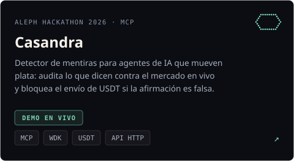
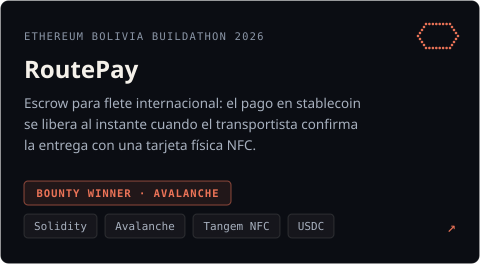
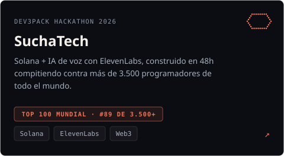
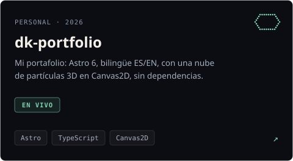
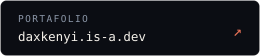

<h1 align="center">Dax Kenji Tellez Duran</h1>

  <code>backend &amp; ai engineer</code>&nbsp;·&nbsp;<code>santa cruz, bo</code>&nbsp;·&nbsp;<code>abierto a roles</code>

  

  Construyo sistemas backend e IA que llegan a producción, 
  siempre partiendo de entender el problema real antes de escribir código.

<picture>
  <source media="(prefers-color-scheme: dark)" srcset="./assets/divider-dark.svg">
  
</picture>

## Proyectos

  
  

  
  

<picture>
  <source media="(prefers-color-scheme: dark)" srcset="./assets/divider-dark.svg">
  
</picture>

## Trayectoria

Abierto a roles de backend e IA aplicada. Antes: backend en **Hola S.R.L. / BCP** (ago 2025 – jun 2026) — middleware LLM en banca con RAG, OCR y webhooks — y proyectos de datos e infraestructura en **Tigo**. Sumando frontend con Next.js para moverme hacia fullstack.

Comunidad: **GDG Santa Cruz** · **YAIS Lab** (AI Research Tour) · staff en **Cursor Buildathon Bolivia**.

<picture>
  <source media="(prefers-color-scheme: dark)" srcset="./assets/divider-dark.svg">
  
</picture>

## Stack

| capa | herramientas |
|:--|:--|
| backend & ia | `Node.js` `TypeScript` `C# .NET 8` `Python` `RAG` `ElevenLabs` `LLM optimization` |
| web3 | `Solidity` `Avalanche` `Solana` `MCP` |
| cloud & devops | `Docker` `GCP` `Azure` `AWS` `Redis` `CI/CD` |
| explorando | `Next.js` `Edge Computing` |

<picture>
  <source media="(prefers-color-scheme: dark)" srcset="./assets/divider-dark.svg">
  
</picture>

  
  
  

